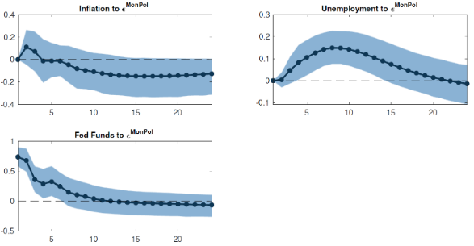

## 6. Vector Auto-Regression (VAR) Models
### Motivation
- n개의 sta. 인 $y_{1t} \cdots y_{nt}$가 있다고 해보자.
    - ex) 이자율/인플레/통화량/소득 등
- VAR은 sta. ts 변수들 모형이다. -> urt를 통해 변수들이 sta.한지 확인할 필요 O
    - sta. 변환 정보손실? -> non-sta. 자체를 이용 : VECM, UC모델
- VAR 활용 예시 : 실업률/인플레율/정책변수 : $u_t,\pi_t,r_t$
    - 통계적 특성 : 변수들의 특성? 상관성이 어떻게?
    - 예측 : 다음 몇기동안의 실업률의 자취는?
    - 인과 추론 : 통화정책 충격이 실업률에 주는 영향?

### Normalization in a reg. EQ
$\alpha^*y_t=\beta^*X_t+e_t\quad e_t\sim N(0,\sigma^{*2})$
1) (양변)$/\alpha^*\to*y_t=\frac{\beta^*}{\alpha^*}X_t+\frac{1}{\alpha^*}e_t\quad \frac{e_t}{\alpha^*}\sim N(0,\frac{\sigma^{*2}}{\alpha^{*2}})\to\beta X_t+\epsilon_t$
    1) $\text{if }\sigma^{*2}=1,\alpha^{*}=1,\beta^*=1;\quad\text{then }\beta=1,\sigma=1$
    2) $\text{if }\sigma^{*2}=4,\alpha^{*}=2,\beta^*=2;\quad\text{then }\beta=1,\sigma=1$
        - 따라서 1)과 2)를 식별 불가
- $X_t,y_t$ structure model : $\alpha^*,\beta^*,\sigma^{*2}$ (3개)
    - reduced form : $\hat{\beta},\hat{\sigma}^2$ (2개)
    - 해결? normalize : $\alpha^*=1$로 표준화 or $\sigma^{*2}=1$로 표준화  (ukknown=2개)
### Structural VAR Model

